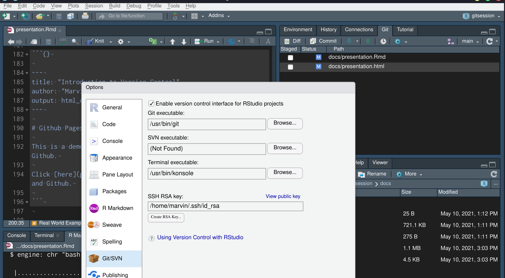

# git

* Version Control System
* Developed by Linus Torvalds to work on the Linux Kernel with mutliple people
* Mainly for Code, but useful for many other things


# Why Version Control?

* "forces" some good habits
    * structured thinking
    * structured working in small chunks
    * goal-oriented
* (supports Open-Source development)


# Get git

* [https://git-scm.com/download/](https://git-scm.com/download/)
* preinstalled on most GNU/Linux distributions
* GUI Versions available

{width=700px}

# git Workflow

* Application with a learning curve
* Simple but easy to mess something up
* Core unit: **A repository**


```{bash, eval = FALSE}
git init    # to start
```


```{bash, eval = FALSE}
git status # to get infos

git add    # to add files to the tracking system

git commit # to define changed files as the new standard
```


# Git Branches - The Tree Model

{width=900px}

```{bash, eval = FALSE}
git branch # to create a new branch

git switch # to switch between branches

git merge  # to merge two branches together
```


# .gitignore

* exclude files and filetypes
* typical example for an R project:

```{bash, eval = FALSE}
.Rhistory
/data/
*.tif
```


# GitHub

* platform for code sharing
* smooth integration into the git workflow
* makes collaborations easy
* *"Developers Social Media"*
* scientific communication


<table><tr>
<td>
{height=100px}
</td>

<td>
{height=100px}
</td>

<td>
{height=100px}
</td>
</tr></table>


# GitHub

* "Cloud storage" for git repositories
* Contains files, code, documentation, installation guide, (data)...

## Additional Features

* Wiki
* Issue - Tracker
* Automation
* ...


# Github Related Commands

```{bash, eval = FALSE}
git remote    # to get infos about remote

git push      # to send commits to remote

git pull      # to download commits from remote
```


```{bash, eval = FALSE}
git clone     # to download a repository
```


## Further Actions

* Forking
* Pull requests


# Overview

{width=1000px}


# Rstudio Integration

Rstudio is a powerful user interface for git!

{width=1000px}

# Real World Example: R packages


[https://github.com/HannaMeyer/CAST](https://github.com/HannaMeyer/CAST)


Package Page created with `pkgdown`

```{r, eval = FALSE}

install.packages("CAST")

devtools::install_github(repo = "https://github.com/HannaMeyer/CAST")

remotes::install_github(repo = "https://github.com/HannaMeyer/CAST")

```

Package Page created with `pkgdown`: [https://hannameyer.github.io/CAST](https://hannameyer.github.io/CAST)


# Real World Example: Bugfix

There is a small Bug in the r-package `getSpatialData`

[https://github.com/16EAGLE/getSpatialData](https://github.com/16EAGLE/getSpatialData)


In the file `R/internal_clients.R` Line 40:

```{r, eval = FALSE}
# wrong:
lapply(uuid, function(x) content(.get(paste0(cred[3], "/odata/v1/Products('", x, "')/", field), cred[1], cred[2])))

# correct:
lapply(uuid, function(x) content(.get(paste0(cred[3], "odata/v1/Products('", x, "')/", field), cred[1], cred[2])))
```


**Which workflow do you propose?**


# Real World Example: Publications

> All computations were done in R (Version 4.0.2; [38]). All presented methods are provided as the R-package uavRmp (https://gisma.github.io/uavRmp/) and the Metashape Python Scripts (https://github.com/envima/MetashapeTools). - Ludwig et al. 2020


<hr>

> The ELC10 dataset is available here: https://doi.org/10.5281/zenodo.4407051 JavaScript and R code to reproduce ELC10 is available here: https://github.com/NINAnor/ELC10 - Venter et al. 2021


# GitHub Pages

Github can serve webpages!

* markdown based
* syntax highlighting

Contents of docs/index.Rmd

```{}
---
title: "Introduction to Version Control"
author: "Marvin Ludwig"
output: html_document
theme: slate
layout: page
---

# Github Pages Demo

This is a demonstration for a simple but effective webpage on Github.

Click [here](presentation.html) for a presentation about git and Github.

```


# Include Large Files

* [DVC: Data Version Control](https://dvc.org/features)
* [LFS: Large File Storage](https://git-lfs.github.com/)

Track large files by including them with text-based pointers

```
outs:
- md5: 13ff4c5c6672752b90da533b408d0024.dir
  size: 1416965813
  nfiles: 13
  path: data/sentinel2
```


# Online Learning Ressources

[Beginner's Guide to Git and Github](https://morioh.com/p/44ff44c19c6e)

[Youtube Video: University lecture with comprehensive technical explanation](https://www.youtube.com/watch?v=2sjqTHE0zok)

[Official Github Ressources: Quickstart Guide](https://docs.github.com/en/github/getting-started-with-github/quickstart)


<style type="text/css">
body, td {
   font-size: 16px;
}
code.r{
  font-size: 25px;
}
code.bash{
  font-size: 25px;
}
</style>